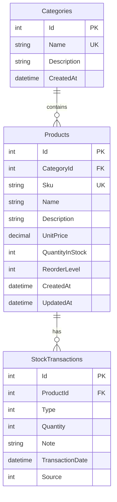

# Inventory Management ER Diagram

## Relationships

- One `Category` can have many `Products`.
- Each `Product` belongs to one `Category`.
- One `Product` can have many `StockTransactions`.
- Each `StockTransaction` belongs to one `Product`.

## Constraints

### Categories

- `Id` is the primary key.
- `Name` is required and unique.
- `Name` has a maximum length of 100.
- `Description` has a maximum length of 500.

### Products

- `Id` is the primary key.
- `CategoryId` is a foreign key to `Categories`.
- `Sku` is required and unique.
- `Sku` has a maximum length of 50.
- `Name` is required and has a maximum length of 150.
- `UnitPrice >= 0`.
- `QuantityInStock >= 0`.
- `ReorderLevel >= 0`.
- Deleting a referenced Category is restricted.

### StockTransactions

- `Id` is the primary key.
- `ProductId` is a foreign key to `Products`.
- `Quantity` cannot be zero.
- `Note` has a maximum length of 250.
- `Type` identifies the stock transaction type.
- `Source` identifies whether the transaction was created by the API or Worker.
- Deleting a Product referenced by StockTransactions is restricted.